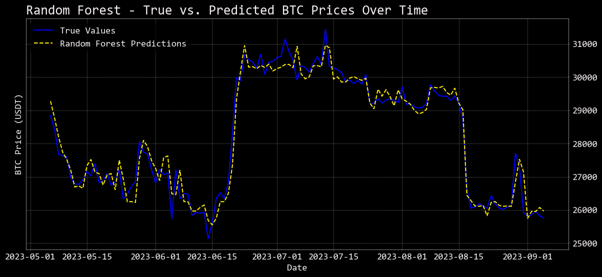
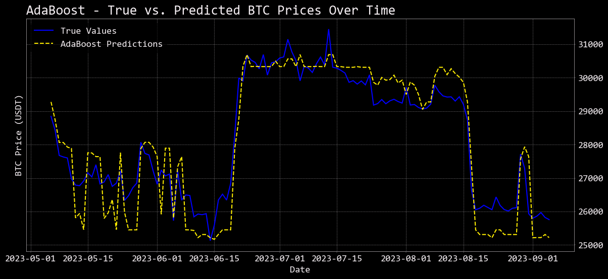
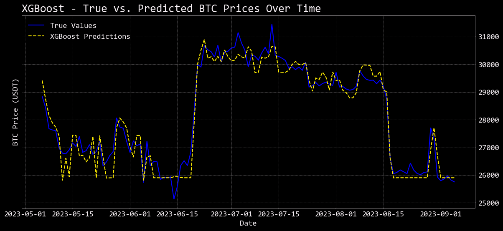
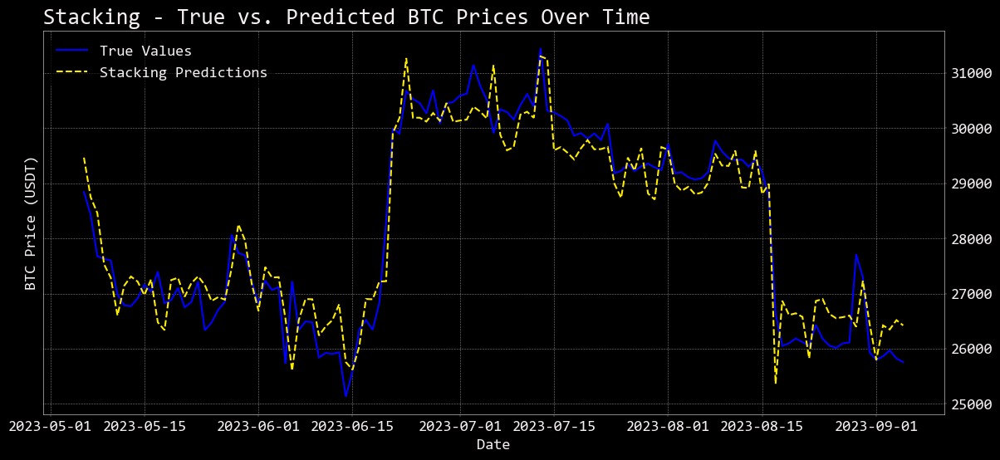
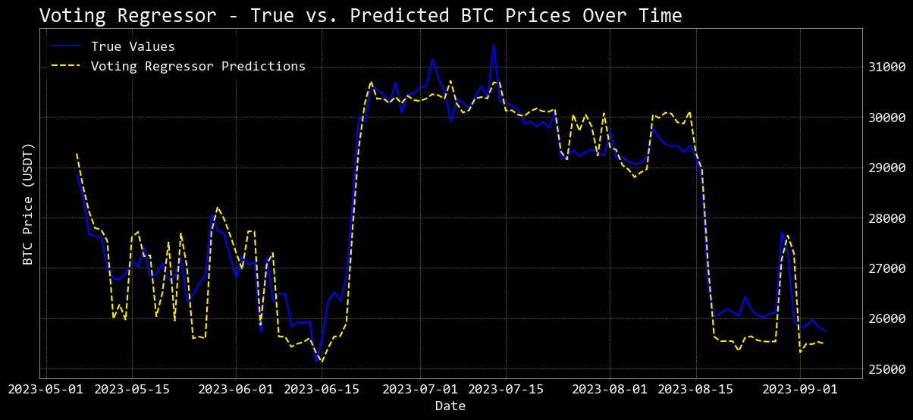
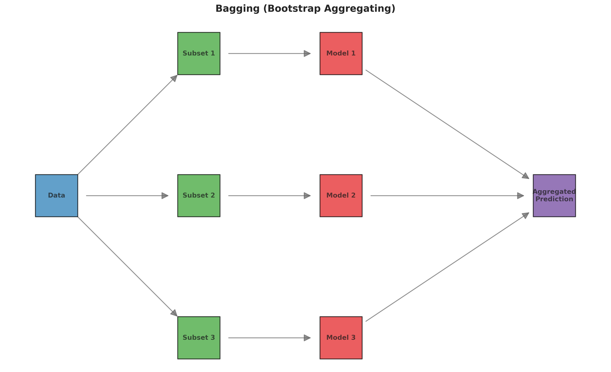
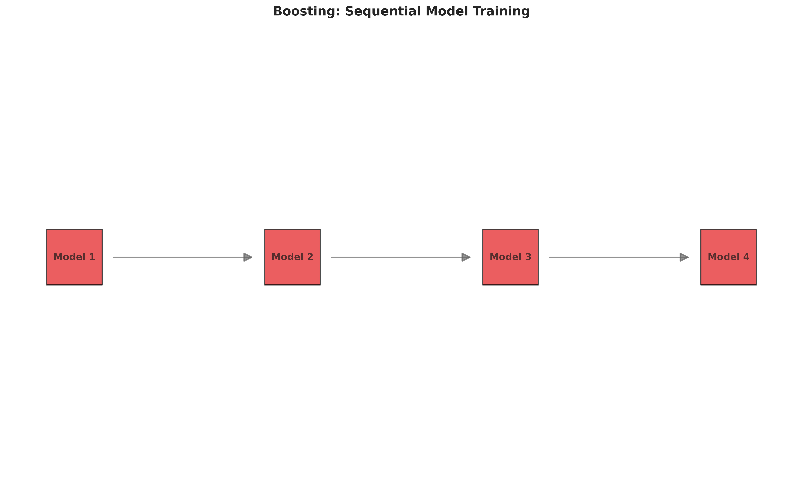
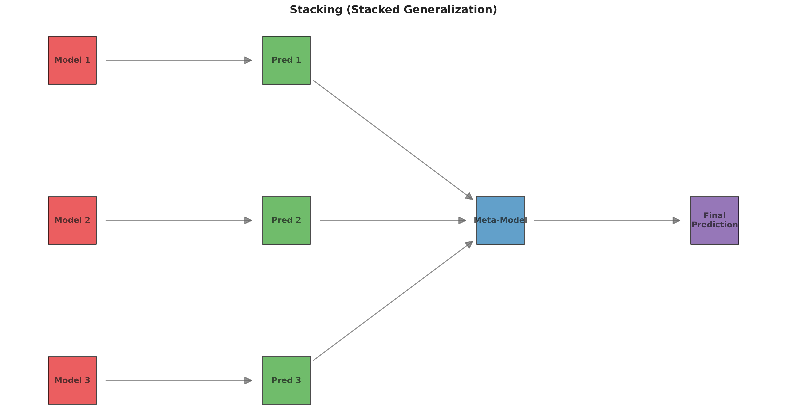
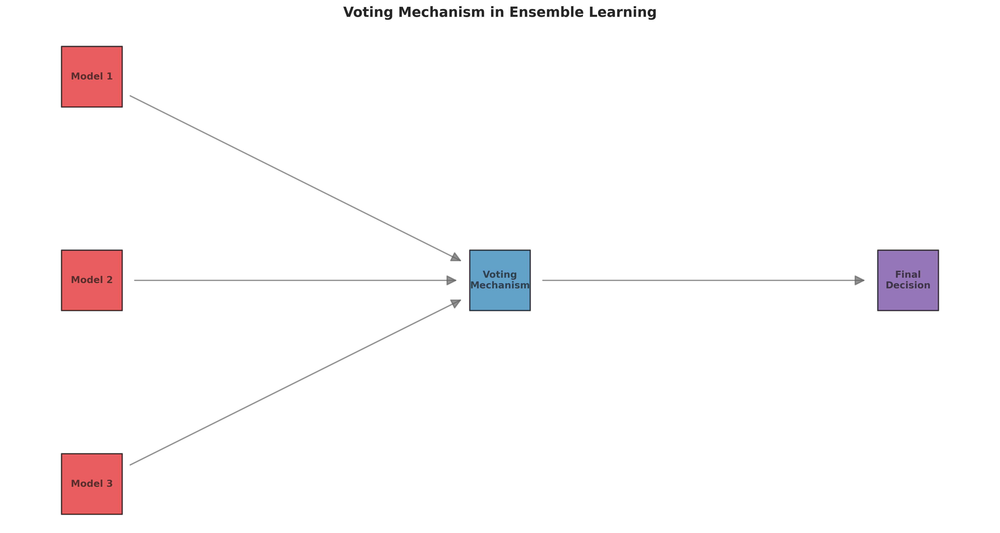

# Ensembles-in-Machine-Learning

## Overview

This project addresses the challenging task of cryptocurrency price prediction, focusing specifically on Bitcoin (BTC-USD) price forecasting. In financial markets characterized by high volatility and non-linear patterns, traditional forecasting methods often fall short of providing accurate predictions.

Ensemble learning methods offer a powerful solution to this problem by combining multiple machine learning models to achieve better predictive performance than any individual model could accomplish alone. By leveraging the collective intelligence of various algorithms, we can capture different aspects of the complex price patterns in cryptocurrency markets.

This project implements and compares several state-of-the-art ensemble methods:

1. **Random Forest** - A bagging-based ensemble that builds multiple decision trees and merges their predictions
2. **AdaBoost** - A boosting algorithm that sequentially builds models by focusing on previously misclassified instances
3. **XGBoost** - An optimized gradient boosting framework known for its speed and performance
4. **Stacking** - A meta-learning approach that uses predictions from multiple models as inputs to a final model
5. **Voting** - A simple but effective method that combines predictions through weighted or unweighted averaging

The implementation includes rigorous hyperparameter tuning, feature importance analysis, and model evaluation using appropriate metrics like Mean Absolute Percentage Error (MAPE). By visualizing ensemble architectures and comparing model performance, this project provides both educational value about ensemble methods and practical utility for cryptocurrency price prediction.

Beyond the predictive models themselves, this repository serves as a comprehensive tutorial on implementing ensemble learning techniques in Python, with visualizations that explain the core concepts behind different ensemble approaches.

## 📈 Model Performance Visualizations

The following visualizations demonstrate how well each ensemble method performs in predicting Bitcoin prices. These plots show the true BTC prices (blue line) versus the predicted prices (dashed lines) over time, allowing you to visually assess the accuracy and performance of each ensemble approach.

### Random Forest Predictions


Random Forest uses bagging to create multiple decision trees and combines their predictions through averaging. This method is particularly effective at handling non-linear relationships in financial data.

### AdaBoost Predictions


AdaBoost sequentially builds models by focusing on previously misclassified instances, creating a strong learner from multiple weak learners. This approach can capture complex patterns in volatile cryptocurrency markets.

### XGBoost Predictions


XGBoost is an optimized gradient boosting framework that provides excellent performance through regularization and efficient tree construction. It's particularly well-suited for financial time series prediction.

### Stacking Regressor Predictions


Stacking uses a meta-learner to combine predictions from multiple base models. This sophisticated approach can capture complex interactions between different algorithms and often achieves superior predictive performance.

### Voting Regressor Predictions


Voting combines predictions from multiple models through weighted or unweighted averaging. This simple yet effective method leverages the collective wisdom of different algorithms to make more robust predictions.

---

*These prediction visualizations demonstrate the practical application of ensemble methods in cryptocurrency price forecasting, showing how different approaches capture market patterns and make predictions over time.*

## 📊 Ensemble Method Visualizations

This project also generates comprehensive visualizations that explain the core concepts behind different ensemble learning methods. Below are the key visualizations created by the `Ensembled_plots.py` script:

### Bagging (Bootstrap Aggregating)


**Bagging** creates multiple models by training on different bootstrap samples of the original dataset. Each model is trained independently, and their predictions are combined through averaging or voting. This approach reduces variance and helps prevent overfitting by leveraging the diversity of multiple models trained on different data subsets.

### Boosting (Sequential Learning)


**Boosting** trains models sequentially, where each subsequent model focuses on correcting the errors made by previous models. This creates a strong learner by combining multiple weak learners, with each model learning from the mistakes of its predecessors. The final prediction is a weighted combination of all models.

### Stacking (Stacked Generalization)


**Stacking** uses a meta-learner that combines predictions from multiple base models. The base models are trained on the original dataset, and their predictions become input features for the meta-learner. This approach can capture complex interactions between different algorithms and often achieves superior performance through sophisticated model combination.

### Voting (Ensemble Decision Making)


**Voting** combines predictions from multiple models through a democratic process. Models can contribute equally (hard voting) or with different weights (soft voting) based on their individual performance. This simple yet effective method leverages the collective wisdom of multiple algorithms to make more robust predictions.

---

*These visualizations demonstrate the fundamental differences between ensemble approaches and help understand how each method combines multiple models to achieve better predictive performance than any single model could accomplish alone.*

## 📁 Project Structure

```
Ensembles-in-Machine-Learning/
│
├── btc_usd.py                          # Main script for Bitcoin price prediction using ensemble models
│                                       # Implements data fetching, preprocessing, model training and evaluation
│
├── ensembled_plots.py                  # Visualization script for ensemble learning concepts
│                                       # Creates network diagrams to explain different ensemble methods
│
├── output/                             # Generated visualizations and results
│   ├── bagging_plot.png                # Visual representation of the bagging ensemble method
│   ├── boosting_plot.png               # Visual representation of the boosting ensemble method
│   ├── stacking_plot.png               # Visual representation of the stacking ensemble method
│   └── voting_plot.png                 # Visual representation of the voting ensemble method
│
├── BTC_USD.ipynb                       # Jupyter notebook version of the Bitcoin price prediction model
│
├── Ensembled_plots.ipynb               # Jupyter notebook version of the ensemble concept visualizations
│
├── requirements.txt                    # List of Python package dependencies with versions
│                                       # Includes scikit-learn, xgboost, yfinance, matplotlib, etc.
│
├── .gitignore                          # Specifies files and directories to ignore in git versioning
│                                       # Excludes venv/, __pycache__/, output/, and other generated files
│
│
└── README.md                           # Project documentation and overview
```

## 🔧 Setup and Installation Instructions

### Create a virtual environment and activate it

```bash
python3 -m venv .venv
source .venv/bin/activate   # On Windows: .venv\Scripts\activate
```

### Install dependencies

```bash
pip install -r requirements.txt
```

## 🛠️ Step-by-Step Guide

### Step 1: Run the ensemble visualization script

```bash
python ensembled_plots.py
```

This script creates visual network diagrams that explain the architecture and data flow of four key ensemble learning methods:
- **Bagging**: Shows how multiple base models are trained on bootstrapped samples and combined through averaging or voting
- **Boosting**: Illustrates the sequential learning process where each model corrects errors from previous models
- **Stacking**: Demonstrates how predictions from multiple models become inputs for a meta-learner
- **Voting**: Presents how different models' predictions are combined through weighted or unweighted averaging

After execution, four PNG images will be generated in the project root directory.

There is a Juypter notebook version of the ensemble visualization script that allows for interactive exploration of the visualization parameters and explanations.

### Step 2: Run the Bitcoin price prediction script

```bash
python btc_usd.py
```

This is the main script that implements a complete Bitcoin price prediction workflow:
1. Downloads historical BTC-USD price data using yfinance
2. Preprocesses data and creates technical indicator features
3. Splits data into training and testing sets
4. Trains multiple ensemble models with hyperparameter tuning:
   - Random Forest
   - AdaBoost
   - XGBoost
   - Stacking Regressor
   - Voting Regressor
5. Evaluates models using Mean Absolute Percentage Error (MAPE)
6. Generates feature importance plots for tree-based models
7. Makes next-day BTC-USD price predictions

The script outputs performance metrics, plots, and predictions directly in the console.
